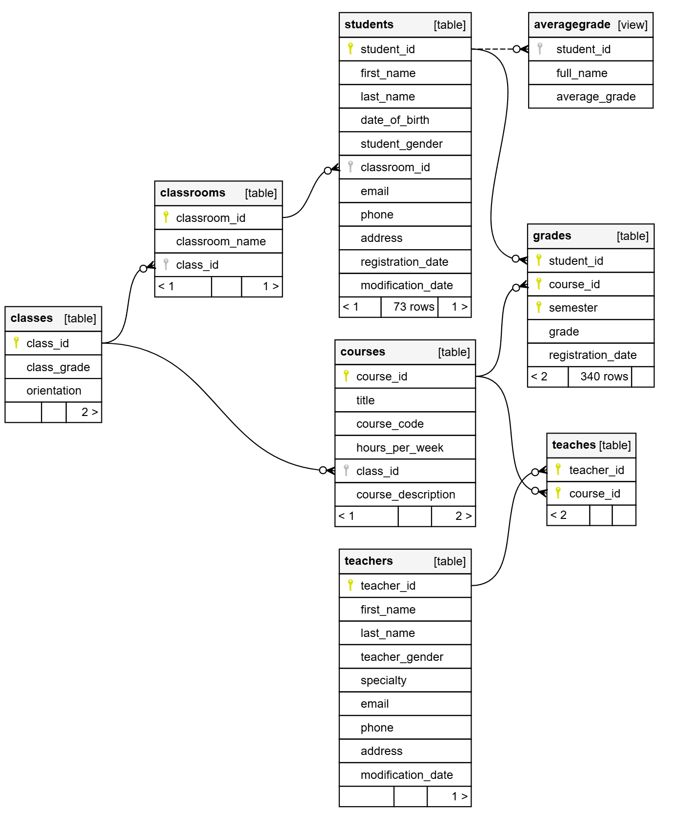
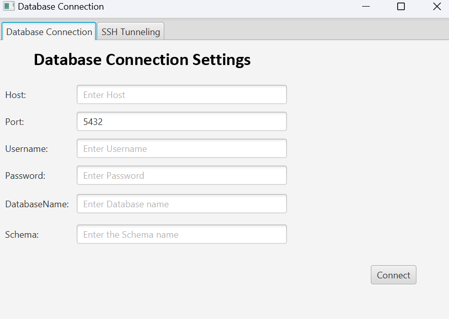
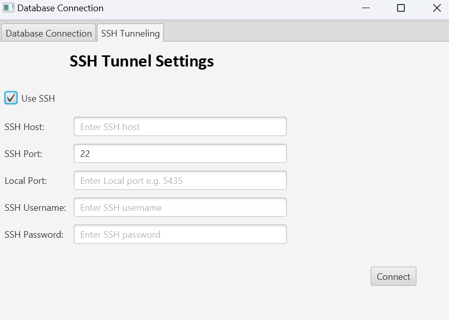
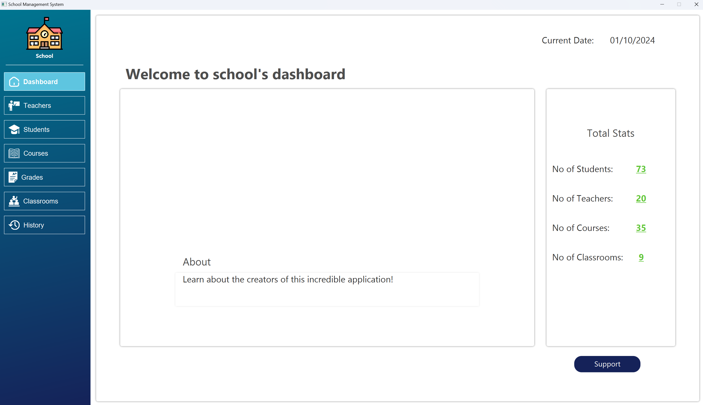
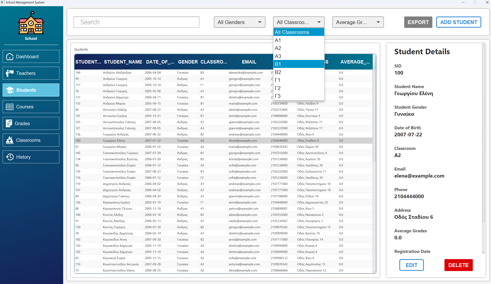

# School Management System
This is a JavaFX-based school management application that connects to a PostgreSQL database using JDBC. The PostgreSQL database is containerized using Docker and managed through a `docker-compose.yml` file. The application is packaged as a `.jar` file for easy distribution and execution.

## Features
- User-friendly interface for managing school-related data.
- Manage students, teachers, classes and courses.
- View and update records (CRUD operations).
- Search and filter records with ease.
- View logs.

## Database Schema Overview
The database schema is structured to store and manage information related to:

- **Students**: Personal and academic information.
- **Teachers**: Personal information and subjects taught.
- **Classes**: Class details and student enrollments.
- **Courses**: Course details and class schedules.
- **Grades**: Student grades and assessments.



The schema is normalized to ensure efficient storage and retrieval of data, with well-defined relationships between tables.

## Technologies Used
- **JavaFX**: For building the desktop user interface.
- **PostgreSQL**: Relational database used for storing school data.
- **JDBC**: Java Database Connectivity to connect Java applications with the PostgreSQL database.
- **Docker**: Used to containerize and run the PostgreSQL database.

## Prerequisites
To run this application, ensure you have the following installed:

1. **Java Development Kit** (JDK) 21 or later
2. **Docker** and **Docker Compose**
3. **PostgreSQL JDBC Driver** (included in the project)

## Setup Instructions

1. **Clone the repository**:
    ```bash
    git clone https://github.com/Vasilis-Thomas/School-Management-System.git
    cd School-Management-System
    ```

2. **Setup PostgreSQL Database**:
   - Adjust the environment variables defined in `.env` that are used to setup and deploy the PostgreSQL container.
    ```bash
    docker-compose up -d
    ```
4. **Running the Application**:
   ```bash
   java -jar target/schoolManagementSystem.jar
    ```

## Screenshots

<div align="center">
  <table>
    <tr>
      <td align="center">
        <br/>
      </td>
      <td align="center">
        <br/>
      </td>
    </tr>
</table>
</div>






## Authors

👤 **Θωμάς Βασίλειος**
* GitHub: [@Vasilis-Thomas](https://github.com/Vasilis-Thomas)

👤 **Σαρακενίδης Νικόλαος**
* GitHub: [@Nikoreve](https://github.com/Nikoreve)
